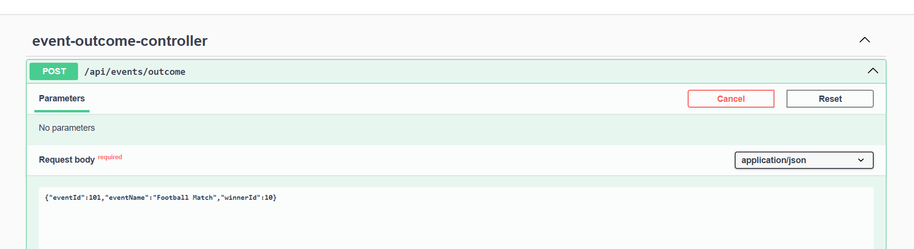
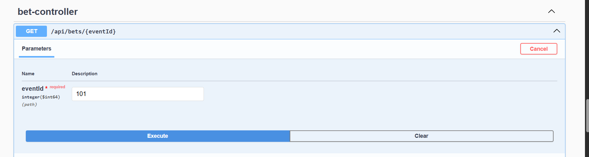

# Settlement Service

A Spring Boot backend that simulates sports betting event outcome handling and bet settlement via **Kafka** and **RocketMQ**.

## Overview

Flow:
1. `POST /api/events/outcome` publishes event outcome to Kafka topic `event-outcomes`
2. Kafka consumer reads event outcome and finds matching pending bets
3. Settlement messages are produced to `bet-settlements` *(RocketMQ mocked in-process)*
4. Settlement consumer updates bet status to `WON` / `LOST`

## Tech Stack

- Java 21
- Spring Boot 4
- Kafka
- RocketMQ (mocked per assignment condition)
- H2 in-memory DB
- Docker / Docker Compose
- Actuator + Prometheus + Grafana
- Spotless + JaCoCo
- Swagger/OpenAPI

## Prerequisites

- Java 21
- Docker & Docker Compose
- Make (optional)
- 
## Folder Structure

```
settlement/
├── src/
│   ├── main/
│   │   ├── java/com/sporty/settlement/
│   │   │   ├── SettlementApplication.java   # Spring Boot entry point
│   │   │   ├── controller/                  # REST API endpoints
│   │   │   ├── dto/                         # Request/Response transfer objects
│   │   │   ├── entity/                      # JPA/DB entities
│   │   │   ├── repository/                  # Spring Data repositories (DB access)
│   │   │   ├── service/                     # Business logic
│   │   │   ├── exception/                   # Custom exceptions & handlers
│   │   │   ├── kafka/                       # Kafka producer/consumer integration
│   │   │   └── rocketmq/                    # RocketMQ integration (mocked in-process)
│   │   └── resources/
│   │       ├── application.yaml             # Default config
│   │       ├── application-test.yaml        # Test environment config
│   │       ├── application-prod.yaml        # Production environment config
│   │       ├── schema.sql                   # H2 DB schema definition
│   │       └── data.sql                     # H2 DB seed data
│   └── test/
│       └── java/com/sporty/settlement/
│           ├── controller/                  # Controller unit tests
│           └── integration/                 # Integration tests
├── build.gradle                             # Gradle build definition
├── settings.gradle                          # Gradle project settings
├── Dockerfile                               # Docker image definition
├── docker-compose.yml                       # Local infra (Kafka, Prometheus, Grafana)
```

## Run

### Dev (app local, infra in Docker)

```shell
  docker compose up -d kafka kafbat prometheus grafana
  ./gradlew bootRun
```

Starts:
- Kafka: `localhost:9092`
- Kafka UI (Kafbat): `http://localhost:8090`
- Prometheus: `http://localhost:9191` -> Targets: http://localhost:9191/targets
- Grafana: `http://localhost:3000` (`admin/admin`) 
  - Scrapped Metrics: http://localhost:3000/a/grafana-metricsdrilldown-app/drilldown?from=now-5m&to=now&timezone=browser&var-metrics_filters=application%7C%3D%7Csettlement&var-filters=application%7C%3D%7Csettlement&var-labelsWingman=%28none%29&layout=grid&filters-rule=&filters-prefix=&filters-suffix=&search_txt=&var-metrics-reducer-sort-by=default&filters-recent=&var-ds=PBFA97CFB590B2093&var-other_metric_filters=

App:
- `http://localhost:9090`

### Fully containerised
```shell
  docker compose up --build -d
```

## API

Swagger:
- `http://localhost:9090/swagger-ui.html`

Publish outcome:


```
{"eventId":101,"eventName":"Football Match","winnerId":10}
```

Fetch bets by event to verify settlement:




## Testing

```shell
  ./gradlew clean test
```

Code Coverage:
- `build/reports/jacoco/test/html/index.html`

## Observability endpoints

- `GET /actuator/health`
- `GET /actuator/metrics`
- `GET /actuator/prometheus`

## Code quality
Checks for code formatting using Spotless:
```shell
	./gradlew clean spotlessCheck
```
Auto-formats code using Spotless:
```shell
	./gradlew clean spotlessApply
```
## Cleanup

```shell
	docker compose down -v
	./gradlew clean
```